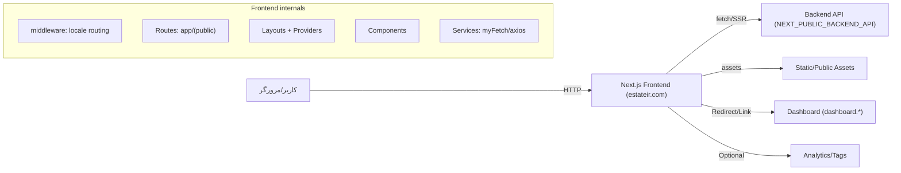

# Architecture (Estateir Frontend)

## هدف این پروژه

این پروژه فرانت‌اند وب‌سایت عمومی estateir است:

- معرفی خدمات و برند
- صفحات درباره ما / تماس با ما
- فرم ثبت درخواست (call request)
- نمایش اطلاعات ملک‌ها (صفحه جزئیات ملک)

## نمای کلی

- Next.js App Router
- داده‌ها از طریق API بک‌اند دریافت می‌شوند (Base URL از env)
- برخی درخواست‌ها Server-Side انجام می‌شود (برای SEO/SSR و کنترل کش)
- برخی فرم‌ها Client-Side هستند (به‌خصوص call-request)

# دیاگرام سطح بالا (Mermaid)

