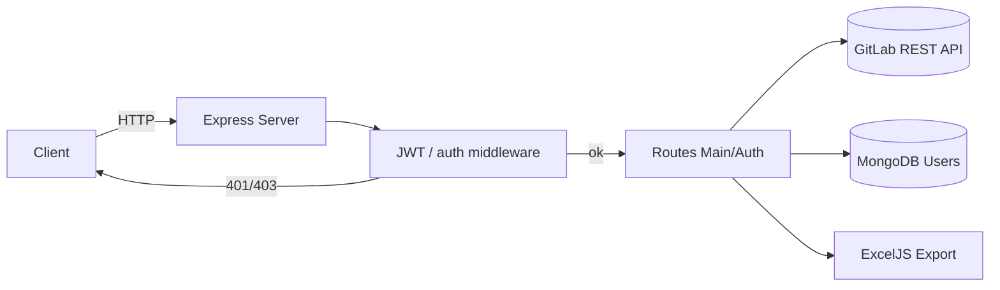

# نمای کلی معماری
این سرویس یک API مبتنی بر Express است که گزارش‌های GitLab (مایلستون، لیبل، زمان و گزارش روزانه) را جمع‌آوری و تجمیع می‌کند. اعتبارسنجی با JWT انجام می‌شود، کاربران در MongoDB ذخیره می‌شوند و داده‌ها از GitLab REST API دریافت می‌گردد.

## اجزای اصلی
- `src/index.js`: بارگذاری env، اجرای `init.js` و راه‌اندازی سرور.
- `src/server.js`: ایجاد اپلیکیشن Express، فعال‌سازی CORS/JSON و ثبت روترها (`masterOAuth`, `master1`).
- `src/routes/auth.js` و `routes/Auth/login.js`: ورود و صدور JWT؛ مسیرهای غیر فعال‌شده ثبت در آینده.
- `src/routes/main.js` و `routes/Main/*`: اندپوینت‌های گزارش (milestones، labels، time-spends، daily، activity-range و ...).
- `src/middleware/auth.js`: اعتبارسنجی JWT، تشخیص ادمین (بر اساس `adminUser`) و تطبیق کاربر با GitLab؛ در حالت `DEV_MODE` کنترل دسترسی دور زده می‌شود.
- `src/utils.js`: کلاینت GitLab (`fetchGitlabUsers`, `getAllIssuesFromProject`, `resolveProjectIds`) و پارسرهای زمان.
- `src/model/*`: مدل کاربر (`User`) و شِمای Mongoose برای مدیریت ادمین/کاربر عادی.
- `Dockerfile`: بیلد ساده Node 22 برای اجرا با `node src/index.js`.

## جریان درخواست
1. درخواست به Express می‌رسد؛ CORS فقط برای دامنه‌های مجاز (`originsC`) فعال است.
2. در مسیرهای گزارش، middleware `auth` هدر `Authorization: Bearer <token>` را بررسی می‌کند. اگر `DEV_MODE=true` باشد، توکن نادیده گرفته و کاربر را ادمین فرض می‌کند.
3. کاربر عادی با لیست کاربران GitLab تطبیق داده می‌شود و `userId` در query/body ایمن‌سازی می‌شود تا دسترسی متقاطع مسدود گردد.
4. هندلرهای `routes/Main/*` پارامترهای پروژه/مایلستون را دریافت کرده و داده‌ها را از GitLab REST API می‌خوانند (به کمک pagination و `perPage`). برخی مسیرها خروجی اکسل می‌سازند (ExcelJS).
5. پاسخ استاندارد JSON برمی‌گردد و خطاها به صورت `status/message` مدیریت می‌شوند؛ خطاهای GitLab با کد 502 مشخص می‌گردند.

## دیاگرام Mermaid

## سطح API و خروجی
| مسیر | متد | ورودی کلیدی | خروجی موفق | خطاهای رایج |
| --- | --- | --- | --- | --- |
| `/login` | `POST` | `username`, `password` | `200 {status:"ok", accessToken, user}` | `400` فیلد ناقص، `401` اعتبار اشتباه، `500` خطای داخلی |
| `/milestones` | `GET` | `projectId` یا `projectId=all`, `milestone` | لیست مسائل هر مایلستون از GitLab | `401/403` توکن یا دسترسی، `502` خطا در GitLab |
| `/Users` | `GET` | `projectId` | لیست کاربران پروژه | `401/403`, `502` |
| `/labels`, `/labels-report` | `GET` | `projectId` | لیبل‌ها و گزارش تجمیعی | `401/403/502` |
| `/time-spends`, `/milestone-daily-spends`, `/daily-report`, `/daily`, `/activity-range` | `GET` | `projectId`, پارامترهای تاریخ | آمار زمان یا خروجی اکسل | `401/403`, `502` GitLab, `500` سایر موارد |

## افزودن یا تغییر قابلیت
1. هندلر جدید را در `routes/Main/<feature>.js` پیاده‌سازی و در `routes/main.js` ثبت کنید (با `asyncHandler`).
2. پارامترهای ورودی را به‌صورت صریح اعتبارسنجی کنید و ساختار خروجی JSON را مطابق جدول بالا نگه دارید.
3. برای دسترسی جدید به GitLab، توابع کمکی را در `utils.js` گسترش دهید و از `perPage`/pagination استفاده کنید.
4. در صورت نیاز به env یا dependency جدید، `docs/configuration.md` و `Dockerfile` را هم‌زمان به‌روزرسانی کنید.
