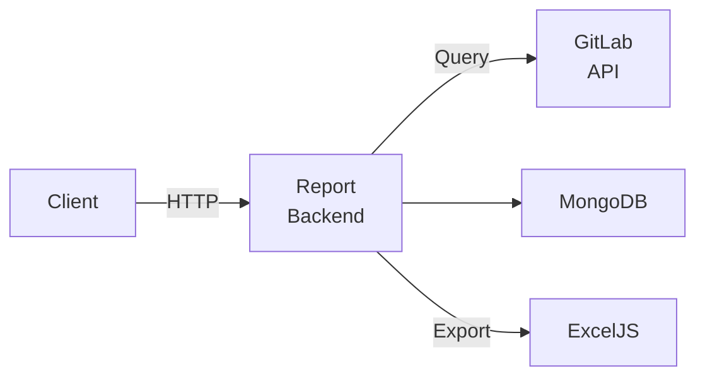

# معماری — GitLab Report Backend (فشرده)

سرویس تولید گزارش‌های GitLab Milestones. Excel export و مدیریت milestone‌ها.

دیاگرام:

فایل‌های مهم: `index.js`/`app.ts`, `package.json`, `swagger.yaml` (در صورت وجود), مدل‌های Mongoose, middleware‌های custom.
